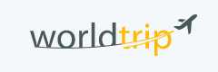

<p align="center">
  
</p>

<br />

<h2>Desktop Version</h2>
<h1 align="center">  
    
</h1>

<p align="center">
  <a href="#-technologies">Technologies</a>&nbsp;&nbsp;&nbsp;|&nbsp;&nbsp;&nbsp;
  <a href="#-getting_started">Getting started</a>&nbsp;&nbsp;&nbsp;|&nbsp;&nbsp;&nbsp;
  <a href="#-project">Project</a>&nbsp;&nbsp;&nbsp;|&nbsp;&nbsp;&nbsp;
  <a href="#-license">License</a>
</p>

<br>

## 🧪 Technologies

This project was developed using the following technologies:

- [React](https://reactjs.org)
- [TypeScript](https://www.typescriptlang.org/)
- [NextJS](https://nextjs.org/)
- [Chakra UI](https://chakra-ui.com/)
- [JSON Server](https://github.com/typicode/json-server)

<br>

## 🚀 Getting started

Clone the project and access the folder

## ✨ Step 1

```bash
git clone https://github.com/mesquini/wordtrip.git && cd wordtrip
```

## ✨ Step 2

Follow the steps below

```bash
# Install the dependencies
$ yarn

# Start the server
$ yarn server

# Start the project
$ yarn dev
```

## 💻 Project

Conclusion project for chapter four. It was developed with everything I’ve learned so far at Ignite.

## 📝 License

This project is licensed under the MIT License - see the [LICENSE](LICENSE) file for details.

---

<p align="center">
  Made with 💜&nbsp; by <a href="https://www.linkedin.com/in/mesquini/">Victor Mesquini</a>
</p>
